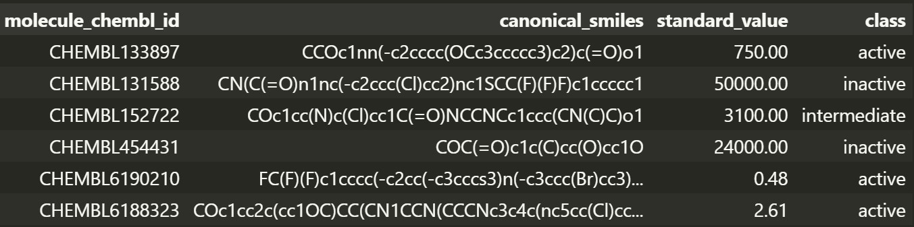
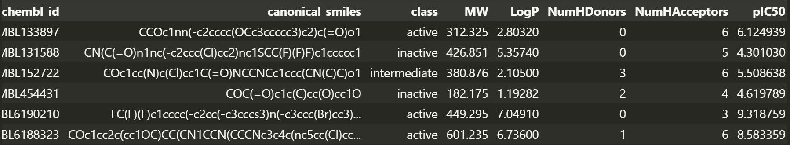
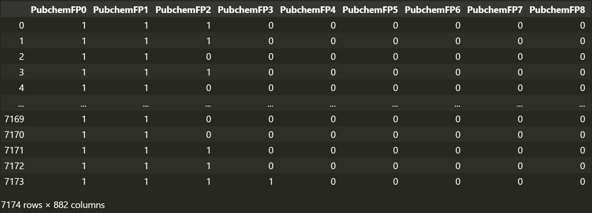
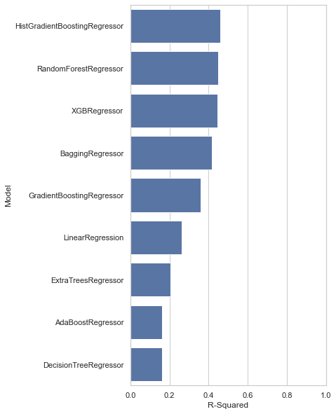
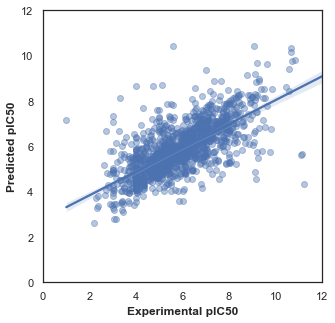
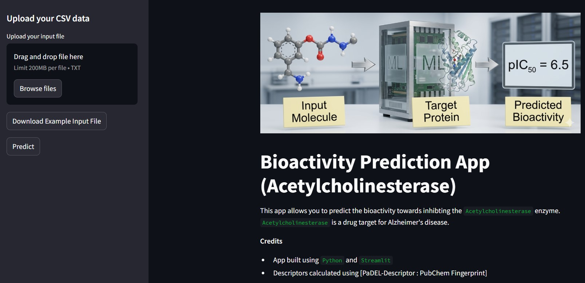

# 🧬 QSAR Modelling of Acetylcholinesterase Inhibitors

A complete **Quantitative Structure–Activity Relationship (QSAR)** workflow for predicting the biological activity of acetylcholinesterase inhibitors using molecular descriptors and machine learning.

This project covers the entire drug-discovery data science pipeline:

- Retrieval of bioactivity data from ChEMBL
- Data preprocessing and curation
- Molecular descriptor generation using PaDEL
- Feature engineering and selection
- QSAR model development
- Hyperparameter optimization
- Model evaluation
- Streamlit web application deployment

## Live Demo
🚀 **Web App:** 


---

## 📂 Project Structure

```text
MAIN/
│
├── Data/
│   ├── acetylcholinesterase_01_bioactivity_data_curated.csv
│   ├── acetylcholinesterase_02_bioactivity_data_3class_pIC50.csv
│   ├── acetylcholinesterase_03_bioactivity_data_3class_pIC50_pubchem_fp.csv
│   ├── descriptors_output.csv
│   └── molecule.smi
│
├── Streamlit/
│   ├── PaDEL-Descriptor/
│   ├── app.py
│   ├── descriptor_list.csv
│   ├── example_input.txt
│   ├── logo.png
│   └── QSAR_regression.pkl
│
├── Knowledge_Base.md
│
├── padel.zip
│
├── QSAR_Part_1.ipynb
├── QSAR_Part_2.ipynb
├── QSAR_Part_3.ipynb
├── QSAR_Part_4.ipynb
├── QSAR_Part_5.ipynb
│
├── Screenshots
│
├── requirements.txt
│
└── packages.txt
```

---

# 🎯 Objective

The goal of this project is to develop a machine learning model capable of predicting the inhibitory activity of compounds against **Acetylcholinesterase (AChE)**.

Acetylcholinesterase is a crucial enzyme responsible for breaking down the neurotransmitter acetylcholine. Inhibiting this enzyme is an important therapeutic strategy in diseases such as:

- Alzheimer's Disease
- Dementia
- Myasthenia Gravis
- Glaucoma

Using molecular descriptors derived from chemical structures, the QSAR model estimates biological activity without requiring laboratory experiments.

---

# 🔬 Workflow

## Part 1 – Data Collection and Curation

### Tasks Performed

- Accessed ChEMBL database
- Retrieved acetylcholinesterase bioactivity data
- Filtered compounds based on IC50 values
- Removed incomplete records
- Standardized dataset

### Output

```text
acetylcholinesterase_01_bioactivity_data_curated.csv
```


---

## Part 2 – Exploratory Data Analysis

### Tasks Performed

- Calculated Lipinski descriptors
- Generated molecular property distributions
- Compared active and inactive compounds
- Performed statistical analysis

### Molecular Properties Studied

- Molecular Weight (MW)
- LogP
- Hydrogen Bond Donors (HBD)
- Hydrogen Bond Acceptors (HBA)

### Output

```text
acetylcholinesterase_02_bioactivity_data_3class_pIC50.csv
```


---

## Part 3 – Descriptor Generation

### Tasks Performed

- Converted molecular structures into SMILES format
- Generated PubChem fingerprints
- Generated molecular descriptors using PaDEL

### Tool Used

**PaDEL-Descriptor**

PaDEL computes hundreds of molecular descriptors that numerically represent chemical structures.

### Outputs

```text
molecule.smi
descriptors_output.csv
acetylcholinesterase_03_bioactivity_data_3class_pIC50_pubchem_fp.csv
```


---

## Part 4 – QSAR Model Development

### Tasks Performed

- Feature preparation
- Train-test split
- Lazypredict for different model fitting
- Model evaluation

### Candidate Models

Examples include:

- Random Forest Regressor
- Extra Trees Regressor
- Gradient Boosting Regressor
- XGBoost


### Goal

Predict:

```text
pIC50
```

from molecular descriptors.



---

## Part 5 – Model Optimization and Deployment

### Tasks Performed

- Hyperparameter tuning
- Cross-validation
- Model comparison
- Final model serialization

### Evaluation Metrics

- R² Score
- Mean Absolute Error (MAE)
- Root Mean Squared Error (RMSE)

### Output

```text
QSAR_regression.pkl
```


---

# 🤖 Machine Learning Pipeline

```text
SMILES
   │
   ▼
Descriptor Generation
   │
   ▼
Feature Matrix
   │
   ▼
Train/Test Split
   │
   ▼
Model Training
   │
   ▼
Hyperparameter Tuning
   │
   ▼
Performance Evaluation
   │
   ▼
Final QSAR Model
```

---

# 🛠 Technologies Used

## Programming

- Python

## Data Processing

- Pandas
- NumPy

## Visualization

- Matplotlib
- Seaborn

## Machine Learning

- Scikit-Learn

## Cheminformatics

- ChEMBL Web Resource Client
- RDKit
- PaDEL-Descriptor

## Deployment

- Streamlit

---

# 🚀 Running the Streamlit App

Navigate to the Streamlit directory:

```bash
cd Streamlit
```

Run:

```bash
streamlit run app.py
```

The application will launch in your browser.

---

# 🧪 Using the Application

### Step 1

Prepare a text file containing SMILES strings.

Example:

```text
CCO
CCN
CCCN
```

---

### Step 2

Upload the file through the Streamlit interface.

---

### Step 3

The application will:

- Generate molecular descriptors
- Match descriptor dimensions with the trained model
- Predict pIC50 values
- Display downloadable results



---

# 📊 Model Output

For each compound, the model predicts:

```text
Predicted pIC50
```

Higher pIC50 values generally indicate stronger inhibitory activity.

---

# 📚 Knowledge Base

A detailed theoretical explanation of:

- QSAR
- ChEMBL
- IC50
- pIC50
- Molecular Descriptors
- Fingerprints
- Lipinski Rule of Five
- Random Forests
- Feature Engineering

can be found in:

```text
Knowledge_Base.md
```

---

# ⚠️ Disclaimer

This project is intended for educational and research purposes only.

Predictions generated by the QSAR model should not be used as a substitute for experimental validation or clinical decision-making.

---

# 👨‍💻 Author

**Sourin Adak**

M.Sc. Physics (Electronics Specialization)  
Data analyst | SQL | Python | Tableu | ML

---

# ⭐ Acknowledgements

This project was inspired by open-source cheminformatics and QSAR workflows.

Special thanks to the developers and research communities maintaining these invaluable scientific tools.